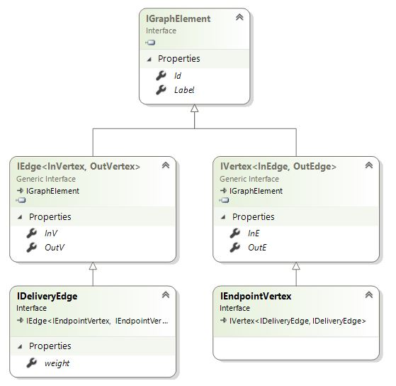
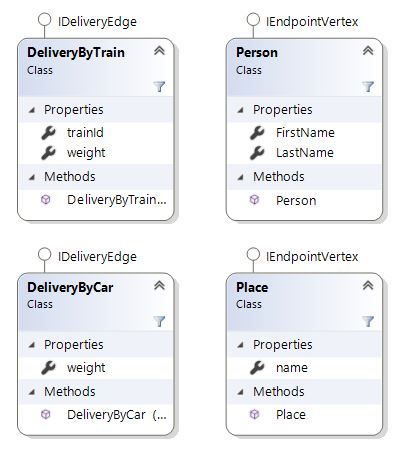
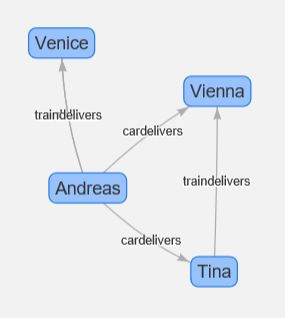

# SpectoLogic.Azure.CosmosDB.Graph
Extension Library with additional functionality for CosmosDB Graph.
Allows Serialization/Deserialization of custom objects for Graph in CosmosDB. Also allows to serialize GraphObjects to native CosmosDB JSON thus allowing you to add Vertices and Edges quickly via normal DocumentDB SQL instead of Gremlin.

**ATTENTION** 
Makes some use of internal functionality of Microsoft.Azure.Graphs. 
Anyone willing to contribute on this is welcome :-).

## Documentation
### Purpose of this libray
This library should solve the current challenges in projects with CosmosDB

* Create a bulk of GraphElements (Vertices/Edges) efficiently in CosmosDB
* Allow developers to retrieve results as plain C# objects
* Allow developers to store plain C# objects as Vertices and Edges
* Allow developers to retrieve multiple types of elements with their graph relations

### Installation

The library is also provided as <a href="https://www.nuget.org/packages/SpectoLogic.Azure.Graph/1.0.0-preview"> Nuget-Package</a>. 

>PM> Install-Package SpectoLogic.Azure.Graph -Version 1.0.0-preview 

### Set up Keys for Demo Application configuration

The AppSettingsSecrets.config is gone, long life dotnet user-secrets. 
Open command line and navigate to your Demo application folder and execute "dotnet user-secrets".

```cmd
> cd \SpectoLogic.Azure.CosmosDB.Graph-netstandard\Source\Demo
> dotnet user-secrets set Account_DemoBuild_Hobbit_Key "<your Key>"
```

### Usage

You can find the sample code with the library which demonstrates the usage. However I also describe two samples here:

#### Simple example
This example shows how you can quickly start working with custom C# objects that represent your edges and vertices. With the library you can easily access those with gremlin queries.

##### Declaring a custom Vertex and Edge
Let's start out with a simple Vertex. 
* The GraphClass attribute is used to declare the class as vertex.
* The GraphProperty is used to declare which properties represent the four predefined properties: Id, Label, InE, OutE. You could use different names for those but I would recommend to stay consistent with the names in Germlin!
* InE, OutE must be of type IList&lt;EdgeType&gt;

This vertex has two custom properties "name" and "country". If you want to access multiple stored values or meta information stored in the graph to your property you can use "GraphProperty" class which provides access to this.

```csharp
    [GraphClass(ElementType = GraphElementType.Vertex)]
    public class Place
    {
        public Place()
        {
            this.Id = Guid.NewGuid().ToString("D");
            this.Label = "place";
        }
        [GraphProperty(DefinedProperty = GraphDefinedPropertyType.Id)]
        public string Id { get; set; }
        [GraphProperty(DefinedProperty = GraphDefinedPropertyType.Label)]
        public string Label { get; set; }

        [JsonIgnore]
        [GraphProperty(DefinedProperty = GraphDefinedPropertyType.InE)]
        public IList<Path> InE { get; set; }

        [JsonIgnore]
        [GraphProperty(DefinedProperty = GraphDefinedPropertyType.OutE)]
        public IList<Path> OutE { get; set; }

        public string name { get; set; }

        public GraphProperty country { get; set; } 
    }
```
The Edge is declared similar. In this sample we use "Path" as the edges between the places. This edge connects two places. For this reason the 
predefined InV and OutV properties point to instances of "Place". Also custom property "weight" is added.
```csharp
    [GraphClass(ElementType = GraphElementType.Edge)]
    public class Path
    {
        public Path()
        {
            this.Id = Guid.NewGuid().ToString("D");
        }
        public Path(Place from, Place to, double weight)
        {
            this.Id = Guid.NewGuid().ToString("D");
            this.Label = "path";
            this.InV = to;
            this.OutV = from;
            this.weight = weight;
        }

        [GraphProperty(DefinedProperty = GraphDefinedPropertyType.Id)]
        public string Id { get; set; }
        [GraphProperty(DefinedProperty = GraphDefinedPropertyType.Label)]
        public string Label { get; set; }

        [GraphProperty(DefinedProperty = GraphDefinedPropertyType.InV)]
        public Place InV { get; set; } 
        [GraphProperty(DefinedProperty = GraphDefinedPropertyType.OutV)]
        public Place OutV { get; set; } 

        public double weight { get; set; }
    }
```

##### Create new graph vertices and edges

Creating vertices and edges objects is quite self explanatory. The GraphProperty which can be used to create more complex properties offers a static factory method.
Pass name and value of the property and as many key/value pairs as meta tags. Calling the chained method "AddValue" allows to add an additional value again with several metatags. Notice that you only pass the value!

```csharp
    Place cave = new Place() 
        { name = "Cave of Hobbit" };
    
    Place restaurant = new Place() 
        { name = "Restaurant Green Dragon" };
                
    Place europe = new Place() 
        { name = "Europe",
          country = GraphProperty.Create(
                "country", "AT", 
                "MetaTag1", "Austria").AddValue(
                    "FI", 
                    "MetaTag1", "Finnland")
        };
    
    Path hobbitPath = new Path(cave, restaurant, 2); 
```

Finally to **create** edges and vertices on the graph in CosmosDB use the extensions mehods on DocumentClient:
* CreateGraphDocumentAsync&lt;T&gt;
* UpsertGraphDocumentAsync&lt;T&gt;

```csharp
    DocumentClient client = ...
    DocumentCollection collection = ...
    
    // Add vertices to the Graph DB
    await client.CreateGraphDocumentAsync<Place>(collection, cave);
    await client.CreateGraphDocumentAsync<Place>(collection, restaurant);
    await client.CreateGraphDocumentAsync<Place>(collection, europe);
    
    // Add edge(s) to the Graph DB
    await client.CreateGraphDocumentAsync<Path>(collection, hobbitPath);
```
See the 'complex' sample on how you can add multiple vertices and edges with the MemoryContext.

##### Using the extensions methods to access the graph

To **retrieve vertices** always use:
* CreateGremlinQuery&lt;Vertex&gt;(...) 

To **retrieve edges** always use: 
* CreateGremlinQuery&lt;Edge&gt;(...)

Use the **ExecuteNextAsyncAsPOCO&lt;*YourType*&gt;** to get a List of your C# items back.

```csharp

    DocumentClient client = ...
    DocumentCollection collection = ...

    // Execute a simple query to access all vertices with label "place"
    string gremlinQueryStatement = "g.V().hasLabel('place')";

    var germlinQuery = 
        client.CreateGremlinQuery<Vertex>(collection, gremlinQueryStatement);
        
        while (germlinQuery.HasMoreResults)
        {
            foreach (var result in 
                     await germlinQuery.ExecuteNextAsyncAsPOCO<Place>())
            {
                Console.WriteLine($"Label:{result.Label} Name:{result.name}");
            }
        }
```

The sample code also contains a sample how you could use the internal GraphTraversal classes of the Microsoft Library. However this is only experimental and will probably go away in future.

#### Complex example
The following example will inherit from predefined interfaces instead of using the GraphPropertyAttribute. In the following diagram you can see that the sample declares two interfaces
* IDeliveryEdge
* IEndpointVertex

Those inherit all predefined properties from their parent interfaces. Notice that IDeliveryEdge refers to IEndPointVertex and vice versa!




The sample uses a combination of two different vertices (Person and Place) and two different edges (DeliveryByTrain, DeliveryByCar). The following diagram shows those entities. Note that the predefined properties are hidden for clarity.



This allows to basically link each entity with either a Train- or Car delivery. The diagram below hides that there are actually two edges from Andreas to Venice (traindelivers and cardelivers). Of course it also would be possible to link two places.
 
 

#### Adding vertices and edges in a bulk with MemoryGraph

```csharp
MemoryGraph context = new MemoryGraph();

// Create some vertices
Person andreas = new Person() { FirstName="Andreas", LastName="Pollak"  }; 
Person tina = new Person() { FirstName="Tina",LastName="Pollak" };
Place vienna = new Place() { name = "Vienna" };
Place venice = new Place() { name = "Venice" };

// Add those vertices to the MemoryGraph
context.Add(andreas,tina,vienna,venice);

// Create edges that link the vertices together
DeliveryByCar andreasTotina = new DeliveryByCar(andreas, tina, 1);
DeliveryByCar andreasToVienna = new DeliveryByCar(andreas, vienna, 1);
DeliveryByCar andreasToVenice = new DeliveryByCar(andreas, venice, 5);
DeliveryByTrain andreasToVeniceByTrain = 
    new DeliveryByTrain(andreas, venice, 3, "TR0012");
DeliveryByTrain tinaToViennaByTrain = 
    new DeliveryByTrain(tina, vienna, 2, "TR0042");

// Add Paths/Edges to the MemoryGraph
context.Add(andreasTotina, andreasToVienna, andreasToVenice,
            andreasToVeniceByTrain, tinaToViennaByTrain);

// Write the partial memory graph with an Upsert to CosmosDB
await client.UpsertGraphDocumentsAsync(collection, context);
```
#### Class definition of edges and vertices
The implementation makes use of interfaces which makes it easy to implement the defined properties. It is **IMPORTANT** that you add the GraphClass-Attribute and set *SerializeTypeInformation* to true. Internally this will make sure that the serializer can create the correct instances (Additional type information is stored to the GraphDB).

```csharp
    [GraphClass(SerializeTypeInformation=true)]
    public class Person : IEndpointVertex
    {
        ...
    }
    
    [GraphClass(SerializeTypeInformation=true)]
    public class DeliveryByCar : IDeliveryEdge
    {
        ...
    }
```

#### Quering edges and vertices
Note that again you create GremlinQueries with the CreateGremlinQuery method passing Vertex or Edge as generic type. However when you execute "ExecuteNextAsyncPOCO" you pass the interface. The type is stored within CosmosDBs GraphDB. This allows the serializer to create the correct instance!

```csharp
MemoryGraph partialGraph = new MemoryGraph();

var query = client.CreateGremlinQuery<Vertex>(collection, "g.V()");

foreach (var result in await
    query.ExecuteNextAsyncAsPOCO<IEndpointVertex>(partialGraph))
{
    Console.WriteLine(result.GetType().Name);
}

var edgeQuery = client.CreateGremlinQuery<Edge>(collection, "g.E()");
foreach (var result in await
    edgeQuery.ExecuteNextAsyncAsPOCO<IDeliveryEdge>(partialGraph))
{
    Console.WriteLine(result.GetType().Name);
}
```

### Technical Details
TO BE DONE


